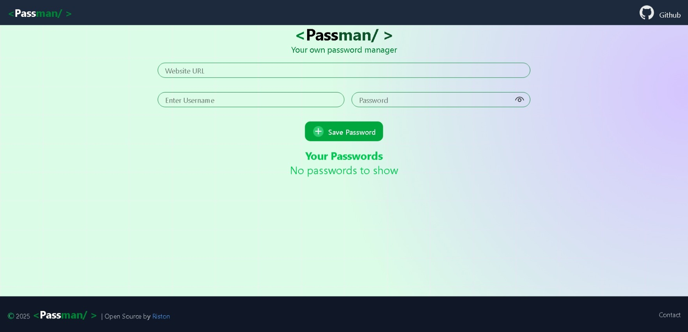
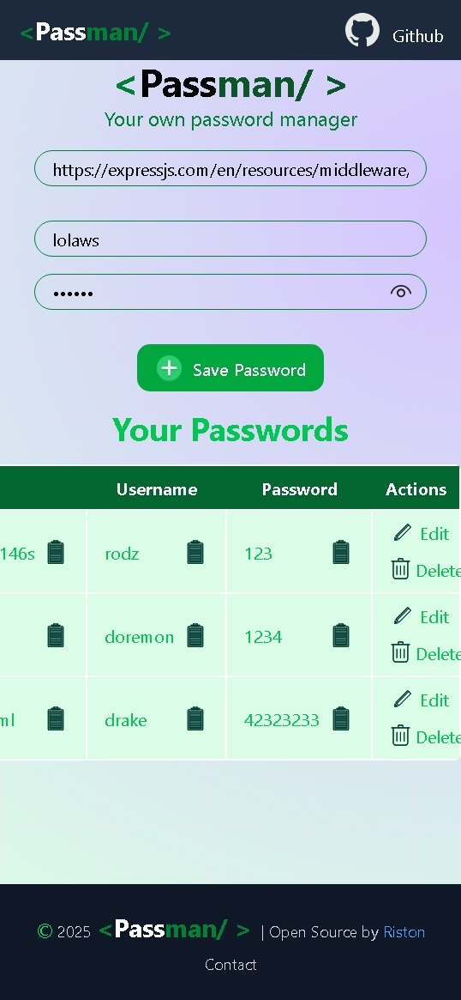
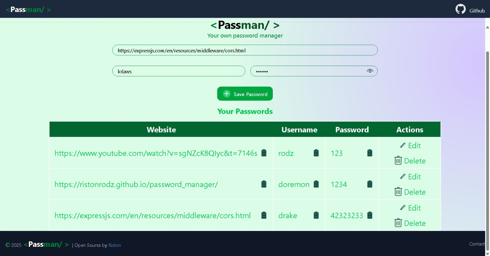

# 🔐 Passman - Password Manager

A sleek, responsive, and secure password manager built using **React** for the frontend and **Node.js + MongoDB** for backend . It allows users to securely store, copy, update, and manage login credentials for their websites.

---

## 🚀 Features

- ✅ Add and save website credentials
- ✅ Edit or delete stored passwords
- ✅ Copy site URL, username, or password with one click
- ✅ Toggle password visibility
- ✅ Toast notifications for actions
- ✅ Responsive UI (mobile-friendly)
- ✅ LocalStorage support 
- ✅ Backend support with MongoDB & Express 

---

## 🖼️ Demo

> You can view the live version here:  
**[🔗 GitHub Pages Live Link](https://ristonrodz.github.io/password_manager/)**

---

## 📦 Technologies Used

| Frontend        | Tools / Libraries             |
|-----------------|-------------------------------|
| React           | Functional Components + Hooks |
| Tailwind CSS    | For styling and layout        |
| React Toastify  | Toast notifications           |
| LocalStorage    | Temporary password storage    |
| UUID            | Unique IDs for passwords      |

---

## 🧠 Folder Structure


---

## 💡 How to Use

### 🛠️ Installation

1. Clone the repo:
   ```bash
   git clone https://github.com/RISTONRODZ/password_manager.git
   cd password_manager
2. run :
   ```bash
   npm install
   npm run dev
## 📸 Screenshots

PassMan offers a clean and responsive interface built with React and Tailwind CSS. Here's how it looks:

### 🔒 Default Desktop View


### 📱 Mobile View


### 🗂️ Password Management Interface



